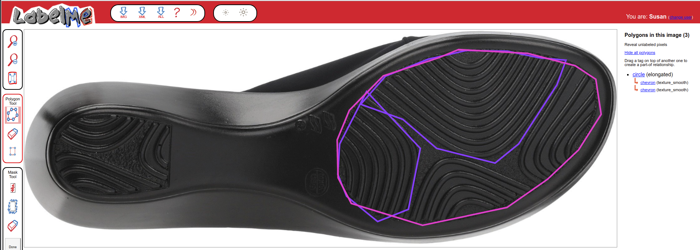
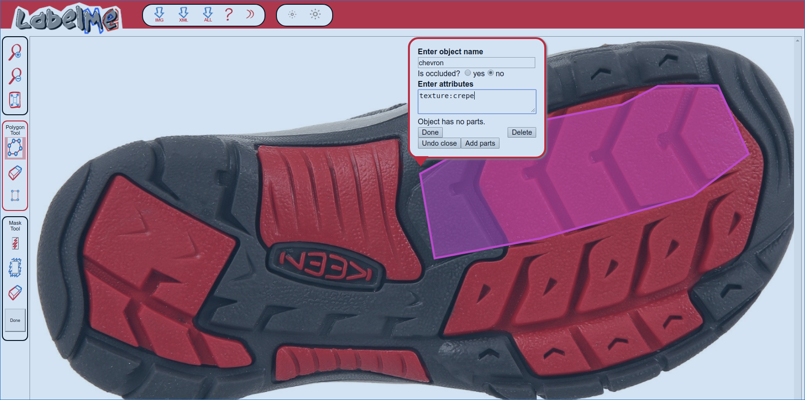
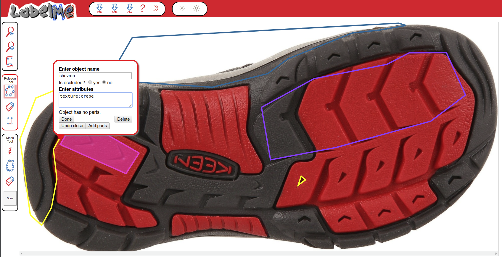
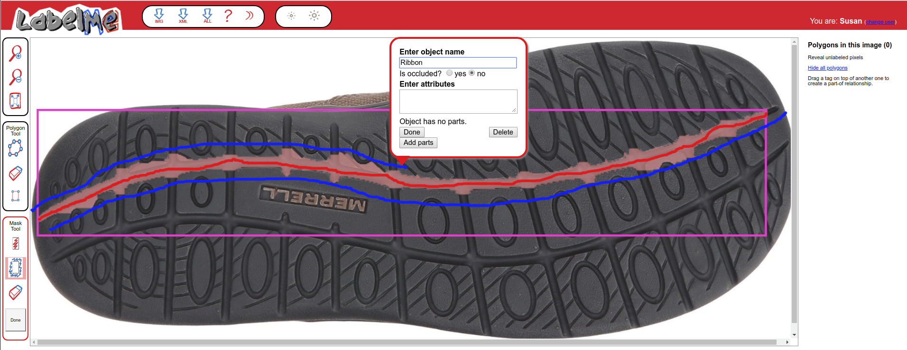
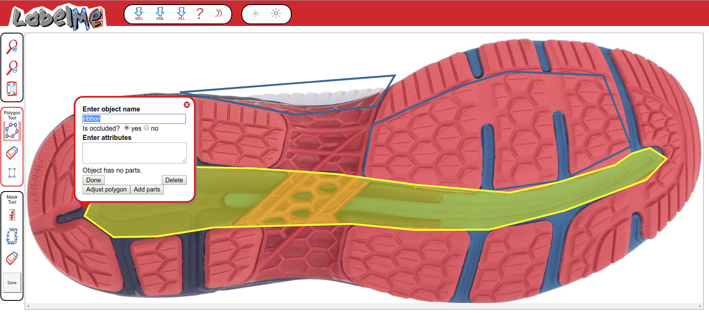

## LabelMe

URL: https://bigfoot.csafe.iastate.edu/LabelMe/tool.html?collection=LabelMe&mode=i

LabelMe is a web-based program designed for computer vision projects. In order to train a computer to recognize image features, it is necessary to first have a labeled database of those features. 

The goal of this project is to recognize shoe tread patterns - the hexagons, circles, logos, lines, and other objects which combine to form the pattern of the tread on the bottom of the shoe. You will use the polygon and mask tools to identify these objects for many different shoes. 

When you enter the tool, an image from the database will be randomly
selected and shown. You can help by annotating as many objects as you can.
Note that previously labeled objects may appear on the image. Please do not label previously labeled objects. Once you have completed the image, you can view a new image by pressing the "show next image" button.

### Polygons

The following steps describe how to label an object:

1. Start by pressing the left mouse button at some point along the boundary of the object.
2. Continue clicking along the boundary of the object
to create a polygon. The boundary edges should be reasonably precise, but do not have to be pixel-perfect.
3. Once you have finished
clicking along the boundary of the object, either click on
the first point or press the right mouse button to complete
the polygon.
4. A window will now appear asking for the object's
name and attributes.  Enter the object's name and provide any additional information you can and click the "Done" button.    
    - Additional information provided in the format key:value will be saved as key_value; this is not an issue. 
    - Capitalization is also not a problem. You may specify plural or singular nouns - e.g. circles and circle will be recorded as the same value. 
    - Spelling does matter, so please check!

## Regions to Exclude

Pictures of the bottom of a shoe are not necessarily equivalent to shoeprints. Any region of the shoe which would not be represented in a shoe print should be excluded (if it is obvious that this is the case). 

## Features of Interest
Features may exist as discrete elements or be nested within other features. Where possible, nesting should be limited to one layer.

The following is a list of commonly occurring features. Features not in the list should be placed in the "Other" category. If there is a commonly occurring feature that isn't in the list, you may email me (srvander@iastate.edu) to ask about adding it to the list.

When classifying features, the goal is to get the dominant feature(s) recorded, even if this is slightly inaccurate. For instance, the following shape isn't completely a chevron, but is "close enough" that a computer-vision algorithm should recognize it as very similar to a chevron.

When more than one of the same feature exist in a region, it is fine to highlight the whole region and label it as containing that feature, so long as the feature you're labeling is the dominant feature in the region.

### Lines

Lines are usually found in groups - a group of lines may be coded as a single object if not interrupted by another geometric object or feature.

    
Note that this set of lines is not a rounded chevron pattern because there are very straight components at the toe of the shoe; when viewed as a set, the lines are not producing a chevron-like pattern.

### Ribbons

Ribbons are curved and typically appear alone (e.g. not in parallel). They may divide the shoe up into segments. For instance, in the image below, there are two ribbons that happen to be in parallel but divide the shoe up into left, center, and right portions, each with different patterns.

Sometimes, objects are occluded. When this occurs, either label both parts of the object excluding the occlusion, or label the whole and mark the image as occluded.

### Circles

Circles encompass ellipse and oval objects as well; these objects would be given an attribute such as "elongated". It is not necessary to mark each individual circle if they are the only geometric object and are tiling the region; it is sufficient to mark the region. 

### Chevron

Chevrons are V-shaped objects or lines (zigzags) which may be curved (add the attribute "rounded"). If an object is a chevron, it is not a line.

### Star

Stars are objects which would be polygons if they were convex, but are instead concave. 

This image has both stars and pentagons. Each region of the shoe should be labeled with both attributes (e.g. define two regions, one with stars, one with pentagons). 

Another example of stars, this time of a triangular sort

Stars may be made up of other objects. If this is the case, label the components as well as the whole.

### Text

Text may be a part of another element or may exist on its own. If it exists on its own, it should be the object name; if it is part of another element it may be better classified as texture.

### Bowtie

Bowties are quadrilaterals with two concave faces opposite two convex faces.

In this image, the text is servivng as a texture, that is, it is used to fill in an element.

### Triangle

Three-sided objects which have straight or mostly straight lines and are convex. It is possible that something may appear triangular but would leave a not-triangular shape - when in doubt, go with the feature that would be left in the shoe print.

Here, the triangles co-occur with hexagons.

### Quadrilateral

Any four-sided figure that is reasonably large. 

"Reasonably large" is definitely subject to interpretation

### Pentagon

Pentagons are 5-sided objects. If there is a question as to whether something is more pentagon-like or is a truncated hexagon or triangle, use your best judgment or gut instinct. It is not always as clear as you'd expect. 

This image has both stars and pentagons. Each region of the shoe should be labeled with both attributes (e.g. define two regions, one with stars, one with pentagons). 

### Hexagon

Hexagons are any six-sided figure. In many cases, they co-occur with triangles.

Here, the entire region containing hexagons is marked. The hexagons aren't quite small enough to be considered a texture (and in any case, the texture would be "hatching" or "segmented" depending on the configuration), so the entire region containing the hexagons is marked. Additional sub-regions may be marked as containing, for instance, quadrilaterals. 

These are classified as hexagons instead of quadrilaterals because the hexagon portion of the shape is more dominant.

Here, the hexagons co-occur with triangles.

### Other

Other may describe a shape not covered in the above categories, or a general region of the shoe (maybe due to subtraction) that has only a texture and no other obvious features

In this figure, the dots are texture, and are not easily individually recognizable. Thus, the "region" of the entire front of the shoe would be the large feature, "other", and the dots are a texture within that region.

In this figure (below), the flowers are the main design element, and the texture element is lines. The lines are not visually dominant when zoomed out to see the design elements.

 

## Texture

Texture attributes are small details that occur **within some other shape**. Specified as texture:value in the attribute field on labelme (the program will convert this to texture_value; this is not a problem). Texture elements would only be useful to the neural nets at a much closer zoom level and are not as visible when zoomed out. You may even have to zoom in to determine which texture category something is in: below, hatching texture is shown, though it looked like it might be dots when zoomed out.

### Smooth

Something with no visible texture attributes. 

### Dots

Dots may be circles but should be fairly small - small enough that marking them all would be ridiculous. The dots shown below are on the larger side.

These dots are much more clearly texture elements.

### Hatching

### Text

Text is a texture when it is used to fill in an image:

Here, the lines are made up of text.

### Lines

Lines should be fine and must be part of another element to be texture. For instance, in the following picture the main elements are chevrons and the lines are primarily filler.

In this image, the main element is the text and the lines are also filler.

### Crepe

Crepe is a texture which is irregular and "random". 

### Other

Other textures which are not smooth but do not fall into another bin can be classified as "other". 

## Modifiers

Modifiers alter the description of a shape. They are included in the attribute field, but do not have an attribute label in front of them (e.g. they appear alone)

### Rounded

Rounded objects (usually applied to polygons or chevrons) may have rounded corners or have curved lines instead of straight lines. For example, here is a rounded triangle:

### Elongated

Elongated is an attribute that differentiates circles from ovals and ellipses. 

