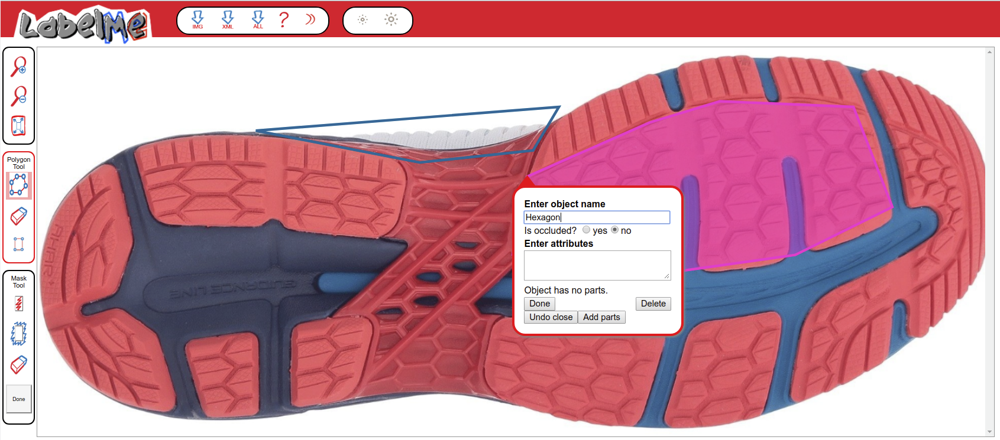

## LabelMe

URL: https://bigfoot.csafe.iastate.edu/LabelMe/tool.html?collection=LabelMe&mode=f&actions=a

LabelMe is a web-based program designed for computer vision projects. In order to train a computer to recognize image features, it is necessary to first have a labeled database of those features. 

The goal of this project is to recognize shoe tread patterns - the hexagons, circles, logos, lines, and other objects which combine to form the pattern of the tread on the bottom of the shoe. You will use the polygon and mask tools to identify these objects for many different shoes. 

When you enter the tool, an image from the database will be randomly
selected and shown. You can help by annotating as many objects as you can.
Note that previously labeled objects may appear on the image. Please do not label previously labeled objects. Once you have completed the image, you can view a new image by pressing the "show next image" button.

### URL options:

1. Append "&actions=a" in order to modify polygons from other users
2. Append "&mode=f" to work through images sequentially; "&mode=i" works through images in random order

### User Interface

#### Labeling Objects

Where possible, aim for regions which are roughly rectangular in shape. 

Rectangle mode:
1. Select the rectangle tool from the toolbar on the left side of the screen
2. Click on a region outside of the feature of interest
3. Click on a region on the other side of the feature of interest, so that the rectangle that appears completely covers the feature of interest.
4. A window will appear asking for the object's name and attributes. Enter the information and click "Done".

Polygon mode:
1. Start by pressing the left mouse button at some point along the boundary of the object.
2. Continue clicking along the boundary of the object
to create a polygon. The boundary edges should be reasonably precise, but do not have to be pixel-perfect.
3. Once you have finished
clicking along the boundary of the object, either click on
the first point or press the right mouse button to complete
the polygon.
4. A window will now appear asking for the object's
name and attributes.  Enter the object's name and provide any additional information you can and click the "Done" button.    
    - Additional information provided in the format key:value will be saved as key_value; this is not an issue. 
    - Capitalization is also not a problem. You may specify plural or singular nouns - e.g. circles and circle will be recorded as the same value. 
    - Spelling does matter, so please check!
    
Mask mode: 
Please do not use mask mode. The resulting annotations are not easily processed.

#### Quality Control:

1. Select the annotated region using the mouse; click to bring up an edit box
2. Ensure that the labels are accurate, spelling is correct, all features in the annotated region are labeled. Multiple labels should be separated by a comma and space.
3. Ensure that the boundary of the annotation completely encompasses the feature labeled - if not, use the "Adjust polygon" button
4. Click Done

## Labeling the Image

### Regions to Exclude

Pictures of the bottom of a shoe are not necessarily equivalent to shoeprints. Any region of the shoe which would not be represented in a shoe print should be excluded (if it is obvious that this is the case). 

Regions which are labeled "exclude" will be removed from the image before any other labels are processed. Thus, if a labeled region is completely within another region labeled "exclude", the labeled image will be completely white. This should be avoided.

## Features of Interest
Features may exist as discrete elements; multiple elements may exist within the same annotated region. When this occurs, only one region should be labeled, but labels should be represented as a comma-separated list.

Where possible, overlapping labeled regions should be avoided. The picture below shows several regions labeled chevron which appear to overlap slightly. Where possible, overlap should be minimized, and in no case should more than 25% of a region be duplicated in another region. 

### Lines

Lines are usually found in groups - a group of lines may be coded as a single object if not interrupted by another geometric object or feature. Lines may also divide the shoe up into regions. 

    

Note that this set of lines is not a rounded chevron pattern because there are very straight components at the toe of the shoe; when viewed as a set, the lines are not producing a chevron-like pattern.

### Circles

Circles encompass ellipse and oval objects as well; these objects would be given an attribute such as "elongated". It is not necessary to mark each individual circle if they are the only geometric object and are tiling the region; it is sufficient to mark the region. 

Circles may surround text in some cases; in these situations label the region as "circle,text".

Circles may also appear even when there is no explicit circle. This region should be labeled as "circle, triangle,star" as the center region is star-like, there are triangles surrounding that central region, and the overall effect is to produce a circle. 

### Chevron

Chevrons are V-shaped objects or lines (zigzags) which may be curved (add the attribute "rounded"). If an object is a chevron, it is not a line.

### Star

Stars are objects which would be polygons if they were convex, but are instead concave. 

This image has both stars and pentagons. Each region of the shoe should be labeled with both attributes ("star,pentagon").

Another example of stars, this time of a triangular sort

Stars may be made up of other objects. If this is the case, label the components as well as the whole ("star,chevron")

### Text

Text may be a part of another element or may exist on its own. If it is part of another element, use both labels. 

This image is from the previous documentation version - if labeled today, the large region would be broken up into two or three smaller, rectangular regions and each region would be labeled "text,line".

### Bowtie

Bowties have two concave faces opposite two convex faces. This image should be labeled "bowtie,text".

Sometimes, bowties take a slightly different form. A butterfly shape can also be seen as a bowtie:

### Triangle

Three-sided objects which have straight or mostly straight lines and are convex. It is possible that something may appear triangular but would leave a not-triangular shape - when in doubt, go with the feature that would be left in the shoe print.

In this image, the triangle shape labeled should be larger, to catch the borders of the shape. 

In this image, the region around the triangle should be included - the labeled region should be quadrilateral.

Here, the triangles co-occur with hexagons. THe figure should be labeled "triangle,hexagon"

### Quadrilateral

Any four-sided figure that is reasonably large. In this image, it would be better if the labeled region were more rectangular. 

"Reasonably large" is definitely subject to interpretation. In this image, it would be better if the labeled region was split into two and each region were roughly rectangular. 

### Pentagon

Pentagons are 5-sided objects.

This image has both stars and pentagons. Each region of the shoe should be labeled with both attributes ("star, pentagon")

### Hexagon

Hexagons are any six-sided figure. In many cases, they co-occur with triangles.

These are best classified as "hexagon,quad" and possibly "hexagon,quad,line" both because of the line bisecting each hexagon and the lines intruding on the hexagon tiling.

Here, the hexagons co-occur with triangles. The image should be labeled "hexagon,triangle"

### Polygon

A polygon is any straight(ish) sided object that has more than 4 edges (for the purposes of this study, quadrilaterals and triangles aren't polygons). It is preferable to label hexagons and pentagons instead of polygons, but in ambiguous cases or cases where there are more than 6 sides, label the thing as a polygon. 

### Other

Other may describe a shape not covered in the above categories, or a general region of the shoe (maybe due to subtraction) that has only a texture and no other obvious features

In this figure, the dots are texture, and are not easily individually recognizable. Thus, the "region" of the entire front of the shoe would be the large feature, "other", and the dots are a texture within that region.

In this figure (below), the flowers are the main design element, and the texture element is lines. The lines are not visually dominant when zoomed out to see the design elements.

 

As of about August, 2018, textures and modifiers are less critical to label. The instructions are provided for clarity sake, but texture elements that are recognizable as features described above should be labeled as the feature, not as a texture. 

## Attributes

### Texture

Texture attributes are small details that occur **within some other shape**. Specified as texture:value in the attribute field on labelme (the program will convert this to texture_value; this is not a problem). Texture elements would only be useful to the neural nets at a much closer zoom level and are not as visible when zoomed out. You may even have to zoom in to determine which texture category something is in: below, hatching texture is shown, though it looked like it might be dots when zoomed out.

#### Smooth

Something with no visible texture attributes. 

#### Dots

Dots may be circles but should be fairly small - small enough that marking them all would be ridiculous. The dots shown below are on the larger side.

These dots are much more clearly texture elements.

#### Hatching

#### Text

Text is a texture when it is used to fill in an image:

Here, the lines are made up of text.

#### Lines

Lines should be fine and must be part of another element to be texture. For instance, in the following picture the main elements are chevrons and the lines are primarily filler.

In this image, the main element is the text and the lines are also filler.

#### Crepe

Crepe is a texture which is irregular and "random". 

#### Other

Other textures which are not smooth but do not fall into another bin can be classified as "other". 

### Modifiers

Modifiers alter the description of a shape. They are included in the attribute field, but do not have an attribute label in front of them (e.g. they appear alone)

#### Rounded

Rounded objects (usually applied to polygons or chevrons) may have rounded corners or have curved lines instead of straight lines. For example, here is a rounded triangle:

#### Elongated

Elongated is an attribute that differentiates circles from ovals and ellipses. 

